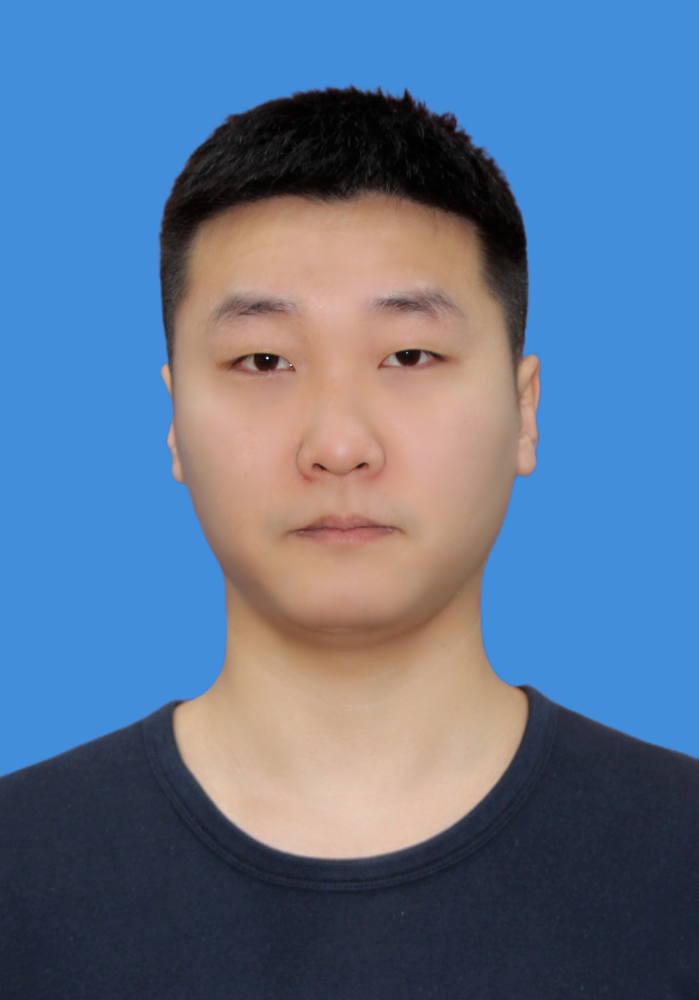

  <!-- 左侧部分 -->
  

    <h1>邵衎杰</h1>
    

      18831255593 ·
      <a href="mailto:kanjieshao@qq.com">kanjieshao@qq.com</a> ·
      <a href="https://gitee.com/qipai-feiying">qipaifeiying</a> ·
      <a href="https://blog.csdn.net/qq_45488453">个人博客</a>
    

  

  <!-- 右侧照片 -->
  

    
  

 ##  个人信息 

 - 男，2001 年出生
 - 政治面貌：中共党员

##  教育经历

- 硕士，西北农林科技大学大学，计算机科学与技术专业，2023.9至今
- 学士，西北农林科技大学大学，软件工程专业，2019.9~2023.7
- 绩点：3.63，年级前 20%
- 通过了 CET4/6 英语等级考试

##  获奖经历

- 中国研究生数学建模竞赛三等奖，组长  2024.11
- 团体程序设计天梯赛全国总决赛二等奖 2022
- RoboCom 机器人开发者大赛 CAIP 编程设计全国总决赛三等奖 2022
- 年度第三届全国大学生算法设计与编程挑战赛银奖  2021-2022
- 十三届蓝桥杯陕西省A组三等奖 2022
- ACM ICPC 陕西省程序设计竞赛铜牌  2021
- 学年专业二等奖学金  2020-2021

##  项目经历

- 点云表面曲线网络构建方法研究 2025

主要内容：构建点云表面符号距离场，抽取等值线，沿等值线梯度方向生成与等值线正交曲线构成点云表面网络，便于后续的三维表面模型重建等下游应用。

- [基于Qt和OpenGL实现的点云符号距离场可视化](https://gitee.com/qipai-feiying/graduation-project/tree/master)及使用MarchingCube进行表面重建  2023年

主要内容：根据表面点云构建三维空间中的符号距离场，使用Qt和OpenGL将结果可视化，并实现点云的平移旋转选点等用户交互，基于生成的符号距离场使用MarchingCube方法提取等值面，实现表面重建。

- 校级创新项目（含软著）:基于kinect的NAO机器人 Visual-SLAM和室内导航研究，组长  2021年

主要内容：基于kinect相机和SLAM方法实现三维地图的实时重建，主要是SLAM方法的学习和linux下的环境搭建，以及kinect相机的api接口使用。

- [校内实习项目：基于深度学习的人脸识别项目]( https://gitee.com/qipai-feiying/works/tree/master/院企实训/yolov3识别项目)，采用了游戏中人物建模作为训练数据集，识别一段游戏CG中的人脸 2022年。
- 修复一个PCL库的bug，并提交PR  2024年

##  技能清单

- ★★★ C++，Python，PCL
- ★★★ OpenGL
- ★★☆ 点云处理库：Open3D，CGAL，pymesh
- ★★☆ 其它 Git，LaTeX，Linux，Docker，Qt
- ★☆☆ UE5

##  技能清单

- 熟悉C++，Python语法，研究生期间大部分三维数据处理基于这两种语言实现
- 熟练使用PCL库，阅读过PCL部分源码，为PCL库修复bug提交PR被接受
- 有OpenGL开发经验，与Qt结合开发的经历，对shader编写及渲染管线有详细了解
- 对Open3D，CGAL，pymesh图形处理库和工具有使用经验
- 对Git，LaTeX，Linux，Docker等工具有使用经历
- 有UE5学习经历

<!-- 标签logo <link rel="icon" href="https://qipaifeiying.oss-cn-beijing.aliyuncs.com/%E5%9B%BE%E7%89%87/202409261801708.jpg" type="image/jpg"> 放在html文件title标签后面head标签前面 -->